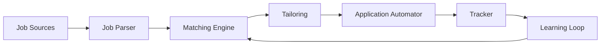

# Workflow

This document summarizes the end-to-end workflow and includes simple diagrams to explain the system.

## High-level Workflow

1. Ingest job sources (boards, referrals, ATS portals)
2. Parse job descriptions and extract key requirements
3. Match candidate profile/resume to roles
4. Tailor resume and cover letter per job
5. Prepare and submit application via automation
6. Track status, outcomes, and feedback
7. Learn from outcomes to improve future applications

## Diagram: End-to-End Flow (Mermaid)



## Diagram: System Architecture (Mermaid)

```mermaid
flowchart TB
    subgraph Client
      CLI[Typer CLI]
      UI[FastAPI UI]
    end

    subgraph Core Services
      Parser[JD Parser]
      Matcher[Semantic Matcher]
      Tailor[ATS Tailoring]
      Automator[Playwright Automator]
      Tracker[State DB]
    end

    subgraph Data
      DB[(SQLite/PG)]
      Vstore[(FAISS/Chroma)]
      Files[(Resumes/Artifacts)]
    end

    LLM[LLM Provider(s)]

    CLI --> Parser
    UI --> Parser
    Parser --> Matcher
    Matcher --> Tailor
    Tailor --> Automator
    Automator --> Tracker

    Tracker --> DB
    Matcher --> Vstore
    Tailor --> Files

    Parser -- prompts --> LLM
    Matcher -- embeddings --> LLM
```

## Step-by-step Summary

- Discover jobs from configured sources
- Extract requirements and normalize fields
- Rank jobs by fit score and user preferences
- Generate tailored resume/cover letter
- Automate application submission with guardrails
- Log each step and capture outcomes
- Provide feedback and continuous improvement

## Notes
- Diagrams use Mermaid syntax and render on platforms that support it (GitHub, some docs tools)
- Replace/extend components based on deployment scale and provider choice
