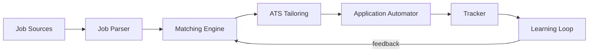
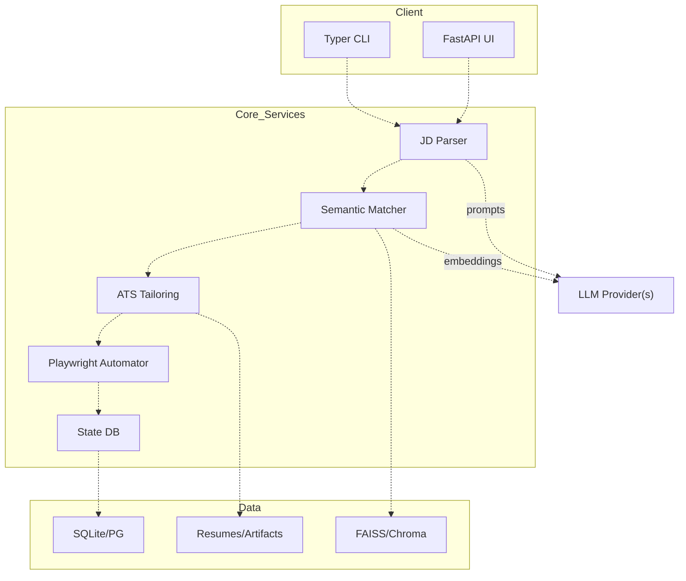

# Workflow
This document summarizes the end-to-end workflow and includes simple diagrams to explain the system.
## High-level Workflow
1. Ingest job sources (boards, referrals, ATS portals)
2. Parse job descriptions and extract key requirements
3. Match candidate profile/resume to roles
4. Tailor resume and cover letter per job
5. Prepare and submit application via automation
6. Track status, outcomes, and feedback
7. Learn from outcomes to improve future applications
## Diagram: End-to-End Flow (Mermaid)
Below is the simple end-to-end workflow diagram for jobhunt, generated in Mermaid.

## Diagram: System Architecture (Mermaid)
Diagram below uses white boxes and dotted lines for a clean modular look.

